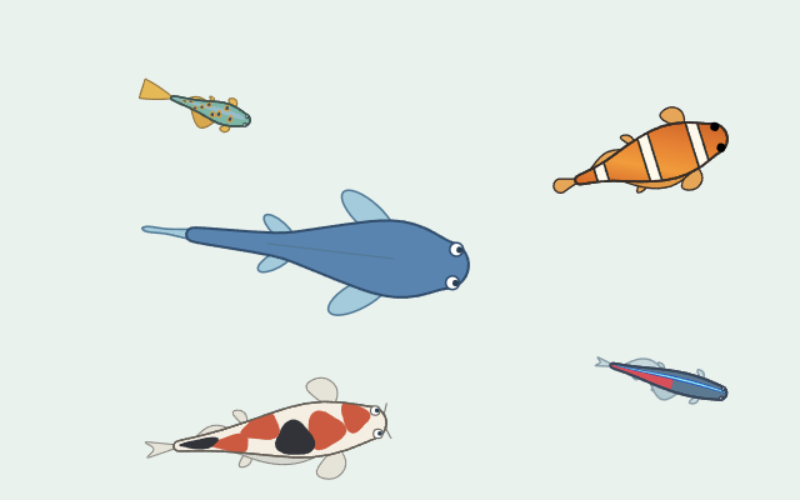
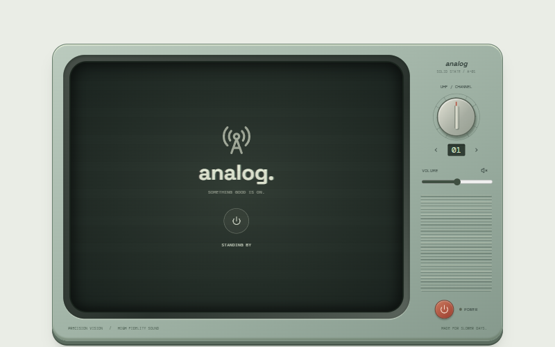
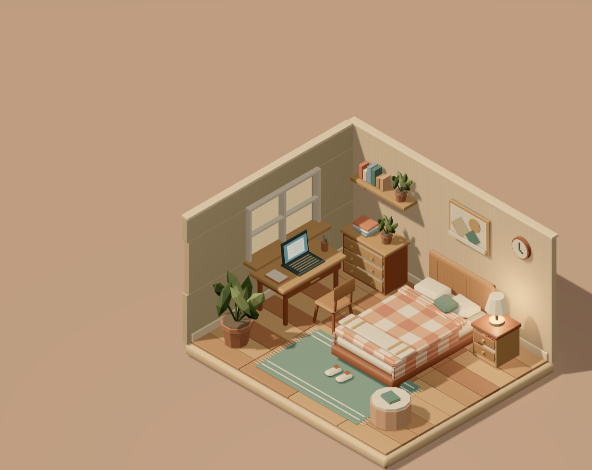
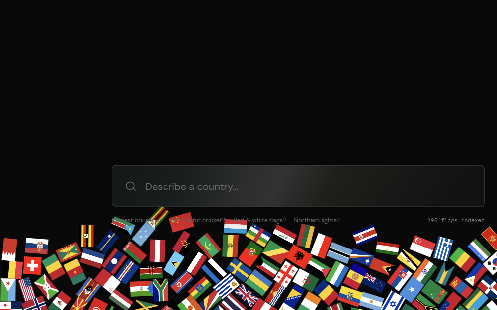

<p align="center">
  <a href="https://lab.blueedge.me/"></a>
</p>

<h1 align="center">Blue Edge Lab</h1>

<p align="center"><strong>New models. Small experiments. Learnings in public.</strong></p>

<p align="center">
  
</p>

<p align="center">
  <a href="https://lab.blueedge.me/"></a>
  <a href="https://github.com/blueedgetechno/lab/stargazers"></a>
  <a href="https://github.com/blueedgetechno/lab/forks"></a>
</p>

<p align="center">
  
  
  
</p>

## Why This Repo

This is my playground for experimenting with new AI models, turning ideas into
working demos, and posting what I learn along the way. By [Blue Edge](https://blueedge.me).

The goal isn't a polished product every time. It's to explore what these models
can help me build, where they struggle, and what it takes to make the results
work. Project READMEs hold the implementation notes, limitations, and learnings.

## The Experiments

<table>
  <tr>
    <td width="50%" align="center">
      <a href="procedurally-fish-animation/README.md"><br /><strong>Just Keep Swimming</strong></a>
    </td>
    <td width="50%" align="center">
      <a href="vintage-tv/README.md"><br /><strong>Analog TV</strong></a>
    </td>
  </tr>
  <tr>
    <td width="50%" align="center">
      <a href="isometric-room/README.md"><br /><strong>Cozy Room</strong></a>
    </td>
    <td width="50%" align="center">
      <a href="jev-country/README.md"><br /><strong>Jev Country</strong></a>
    </td>
  </tr>
</table>

## Directory

| Experiment | Project README | Live |
| --- | --- | --- |
| Just Keep Swimming | [procedurally-fish-animation](procedurally-fish-animation/README.md) | [Open](https://lab.blueedge.me/procedurally-fish-animation/) |
| Analog TV | [vintage-tv](vintage-tv/README.md) | [Open](https://lab.blueedge.me/vintage-tv/) |
| Cozy Room | [isometric-room](isometric-room/README.md) | [Open](https://lab.blueedge.me/isometric-room/) |
| Jev Country | [jev-country](jev-country/README.md) | [Open](https://lab.blueedge.me/jev-country/) |

## Run Locally

With **Node.js 22+**, run from the repository root:

```sh
npm install
npm start
```

Open **http://127.0.0.1:3000/**. No build step. Project-specific requirements,
including optional API keys, live in the READMEs above.

## Deploy to Vercel

Import the repository root with the **Other** framework preset. The included
[configuration](vercel.json) builds browser assets into `dist` and deploys
[the country-search API](api/jev-country.js) at `/api/jev-country`.
See [Jev Country deployment](jev-country/README.md#vercel) for provider keys,
custom-domain origins, and public-endpoint limits. GitHub Pages remains
static-only and cannot run the API.

---

<p align="center">
  
  
  
  
</p>

<p align="center"><a href="https://blueedge.me">blueedge.me</a> &middot; <a href="https://x.com/blueedgetechno">Follow the experiments</a> &middot; <a href="https://github.com/blueedgetechno/lab/issues">Share an idea</a></p>